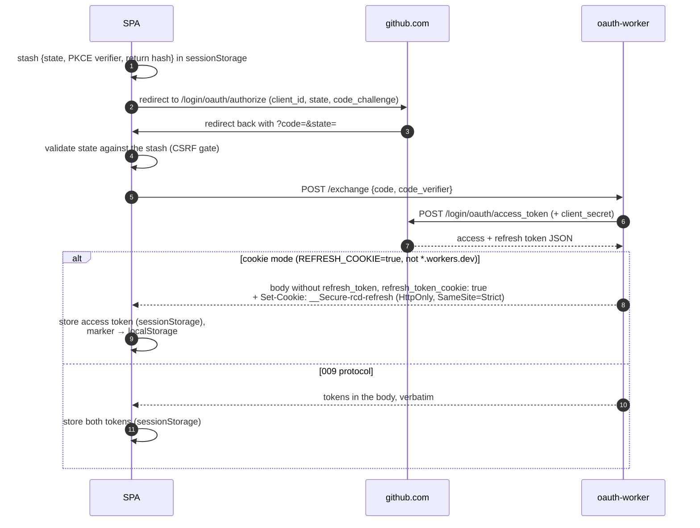
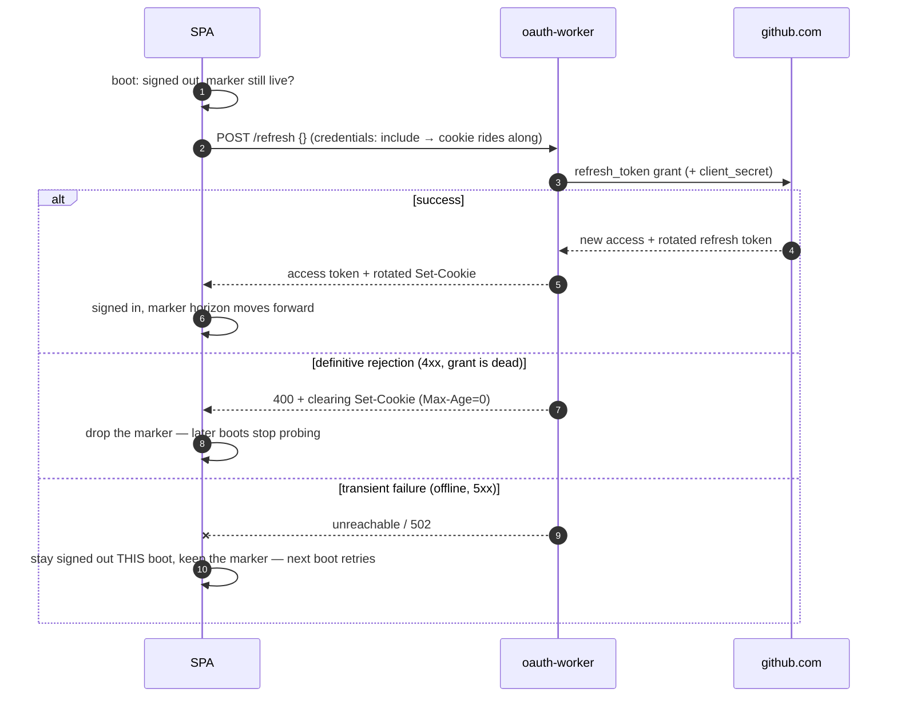

# Auth flow

How "Sign in with GitHub" works: the SPA drives GitHub's authorization-code
flow with PKCE, and the only server piece is the stateless oauth-worker that
turns a `code` (or a refresh token) into a GitHub user token. The browser
cannot do that exchange itself: GitHub's token endpoint requires the
`client_secret` and serves no CORS. Every GitHub _content_ request still goes
browser → `api.github.com` directly; the worker never sees a config, a preset,
or an API call.

Design decisions live in [roadmap 009](../roadmap/009-github-oauth-sign-in.md)
(the flow) and [roadmap 065](../roadmap/065-persistent-sign-in.md) (the
refresh-token cookie). Provisioning is in the
[oauth-worker README](../packages/oauth-worker/README.md).

## Where credentials live

| Credential                                           | Location                                      | Lifetime          |
| ---------------------------------------------------- | --------------------------------------------- | ----------------- |
| Access token (~8 h)                                  | memory + `sessionStorage`                     | tab               |
| Refresh token, 009 protocol                          | memory + `sessionStorage`                     | tab               |
| Refresh token, cookie mode                           | `HttpOnly` cookie, scoped to the worker mount | ~6 months         |
| Cookie-session marker (non-secret horizon timestamp) | `localStorage`                                | until the horizon |
| `client_secret`                                      | worker secret store                           | n/a               |

`localStorage` never holds a secret. In cookie mode, XSS can use the session
while a page is open but cannot exfiltrate the long-lived refresh token: the
browser's cookie jar has it, and JS never does.

## Sign-in

A deployment opts into cookie mode with `REFRESH_COOKIE=true`, and the mode is
only correct same-site, so the worker refuses to engage it on a
`*.workers.dev` host. That URL is only ever reached cross-site, where the
browser would drop the cookie.
The production deployment routes the worker at
`renovate.secustor.dev/oauth/*`, the app's own hostname.

## Session lifetime: refresh and boot restore

Closing the tab drops `sessionStorage`. In cookie mode the session survives:
on boot, a live marker triggers one silent `/refresh` whose empty body tells
the worker to read the cookie. When an access token expires mid-session,
`getValidToken` runs the same refresh; on the 009 protocol the body carries
the in-JS refresh token instead of staying empty.

GitHub rotates the refresh token on every use, which is why the restore and
refresh paths are single-flight: a second concurrent `/refresh` would post the
cookie the first one already burned.

Only a definitive 4xx ends the session; a transient failure never destroys
state, because signing out fires `/logout` and could burn a still-good cookie
over a network blip.

## Sign-out

`signOut()` clears memory, every `rcd.oauth.*` storage key, and the marker,
then fires a best-effort `POST /logout`, since only the worker can clear the
`HttpOnly` cookie (the answer carries a clearing `Max-Age=0`). True revocation of the GitHub
grant can only be done on
[github.com/settings/apps/authorizations](https://github.com/settings/apps/authorizations).
