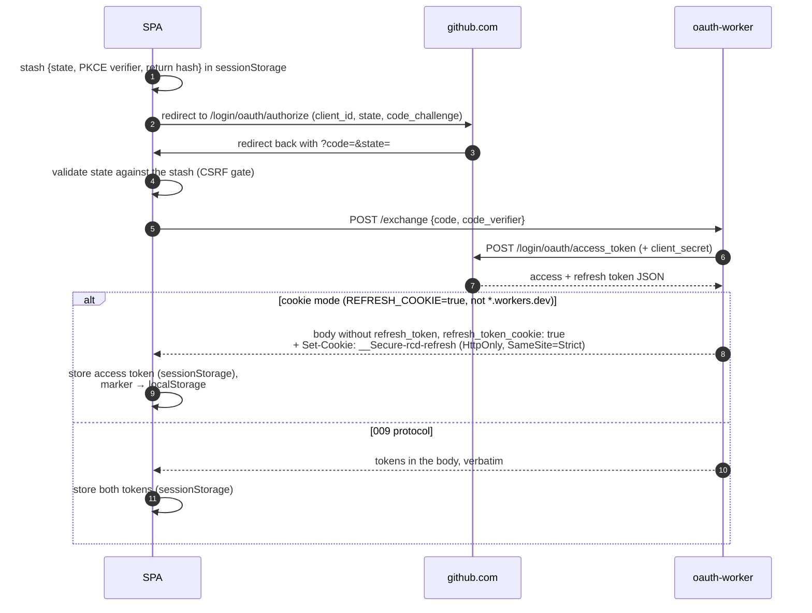
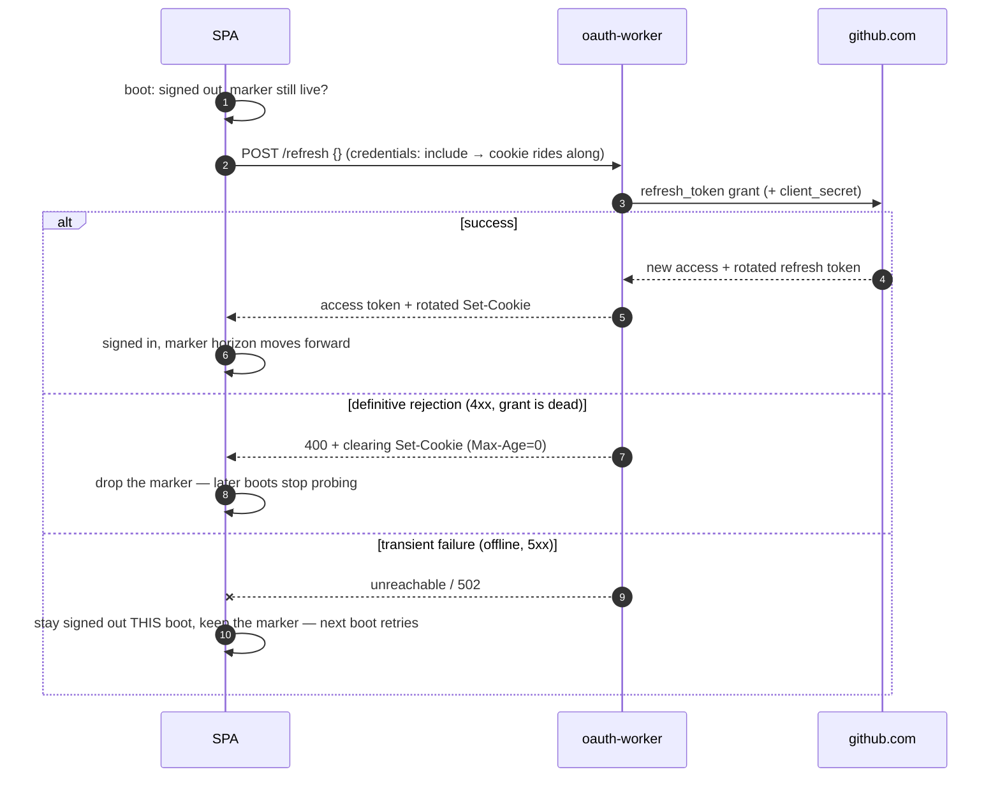
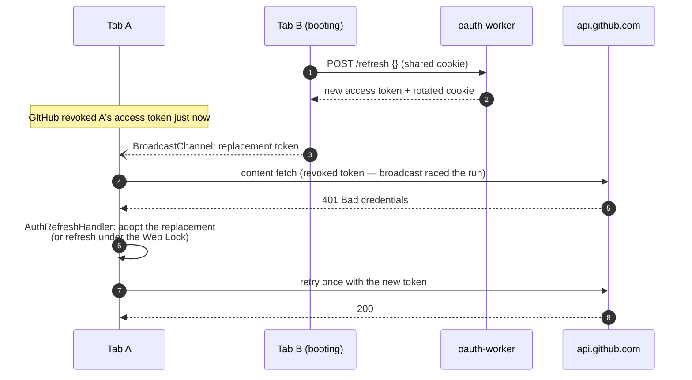

# Auth flow

How "Sign in with GitHub" works: the SPA drives GitHub's authorization-code
flow with PKCE, and the only server piece is the stateless oauth-worker that
turns a `code` (or a refresh token) into a GitHub user token. The browser
cannot do that exchange itself: GitHub's token endpoint requires the
`client_secret` and serves no CORS. Every GitHub _content_ request still goes
browser → `api.github.com` directly; the worker never sees a config, a preset,
or an API call.

Design decisions live in [roadmap 009](../roadmap/009-github-oauth-sign-in.md)
(the flow) and [roadmap 065](../roadmap/065-persistent-sign-in.md) (the
refresh-token cookie). Provisioning is in the
[oauth-worker README](../packages/oauth-worker/README.md).

## Where credentials live

| Credential                                           | Location                                      | Lifetime          |
| ---------------------------------------------------- | --------------------------------------------- | ----------------- |
| Access token (~8 h)                                  | memory + `sessionStorage`                     | tab               |
| Refresh token, 009 protocol                          | memory + `sessionStorage`                     | tab               |
| Refresh token, cookie mode                           | `HttpOnly` cookie, scoped to the worker mount | ~6 months         |
| Cookie-session marker (non-secret horizon timestamp) | `localStorage`                                | until the horizon |
| `client_secret`                                      | worker secret store                           | n/a               |

`localStorage` never holds a secret. In cookie mode, XSS can use the session
while a page is open but cannot exfiltrate the long-lived refresh token: the
browser's cookie jar has it, and JS never does.

## Sign-in

A deployment opts into cookie mode with `REFRESH_COOKIE=true`, and the mode is
only correct same-site, so the worker refuses to engage it on a
`*.workers.dev` host. That URL is only ever reached cross-site, where the
browser would drop the cookie.
The production deployment routes the worker at
`renovate.secustor.dev/oauth/*`, the app's own hostname.

## Session lifetime: refresh and boot restore

Closing the tab drops `sessionStorage`. In cookie mode the session survives:
on boot, a live marker triggers one silent `/refresh` whose empty body tells
the worker to read the cookie. When an access token expires mid-session,
`getValidToken` runs the same refresh; on the 009 protocol the body carries
the in-JS refresh token instead of staying empty.

GitHub rotates the refresh token on every use, which is why the restore and
refresh paths are single-flight within a tab — and serialized ACROSS tabs by a
Web Lock (`rcd.oauth.refresh`): a second concurrent `/refresh`, from a
StrictMode remount or from a sibling tab booting at the same moment, would
post the cookie the first one already burned and end the whole session. After
waiting on the lock, a tab re-checks its state before posting: a sibling's
refresh may already have handed it a fresh token (below), and then there is
nothing left to do.

Only a definitive 4xx ends the session; a transient failure never destroys
state, because signing out fires `/logout` and could burn a still-good cookie
over a network blip.

## Cross-tab coordination (cookie mode)

In cookie mode every tab shares ONE grant — the cookie — while each tab keeps
its own access token in per-tab `sessionStorage`. GitHub revokes the old
access token whenever the grant is refreshed ("that refresh token and the old
user access token will no longer work"), so any tab's refresh invalidates the
token every sibling tab still holds, hours before its recorded expiry — and
the sibling cannot tell locally: its stored horizon still looks fine, so the
silent-refresh machinery never fires.

Two mechanisms close the gap:

- **Token broadcast.** After a cookie-mode refresh, the new access token goes
  out on a `BroadcastChannel` (`rcd.oauth`) and sibling tabs adopt it. A tab
  adopts only when the shared-grant marker is live (the sender re-set it
  before broadcasting) and never over an in-JS refresh token (that tab has its
  own 009 grant); the message is validated like any stored value before it can
  reach a request header. Sign-out broadcasts too, so siblings stop believing
  in tokens the teardown just orphaned.
- **401 recovery.** If a revoked token is sent anyway (the broadcast raced the
  run, or the revocation came from outside — a revoked app grant), the engine
  transport gives the 401 one recovery attempt: a registered
  `AuthRefreshHandler` (engine `auth.ts`, registered per entry point in the
  app's `run.ts`) forces the refresh past the trusted local expiry, pushes the
  renewed auth state, and the request retries once with re-resolved headers.
  If the grant is dead, the session ends cleanly and the retry — and the rest
  of the run — goes out anonymously instead of failing on the dead token. The
  CLI registers no handler, so the headless graph keeps the plain
  throw-on-401.

A rejected personal access token or credentials-row token is not renewable
here — nothing in the app manages those lifecycles — so its 401 surfaces
unchanged.

## Sign-out

`signOut()` clears memory, every `rcd.oauth.*` storage key, and the marker,
broadcasts the sign-out to sibling tabs, then fires a best-effort
`POST /logout`, since only the worker can clear the `HttpOnly` cookie (the
answer carries a clearing `Max-Age=0`). True revocation of the GitHub grant
can only be done on
[github.com/settings/apps/authorizations](https://github.com/settings/apps/authorizations).
